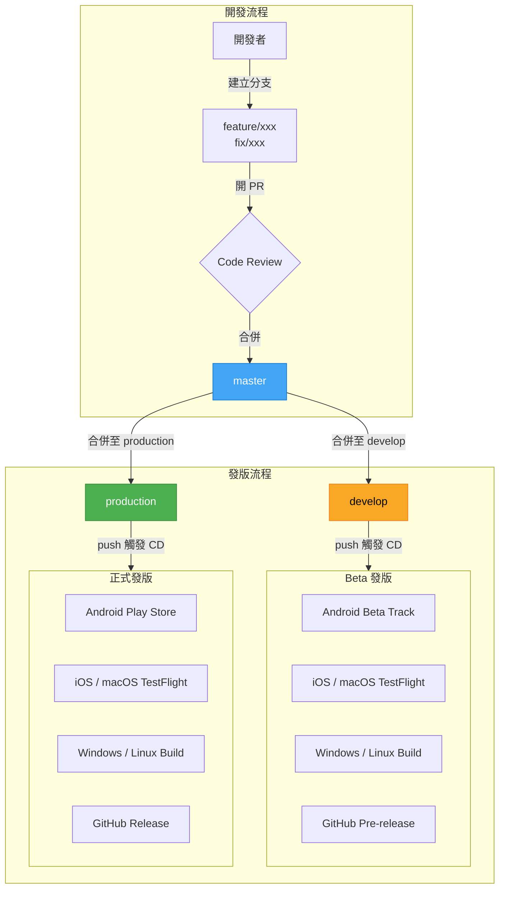

[](https://github.com/NKUST-ITC/NKUST-AP-Flutter/actions/workflows/workflow.yml)
[](https://github.com/NKUST-ITC/NKUST-AP-Flutter/actions/workflows/workflow.yml)

<a href='https://play.google.com/store/apps/details?id=com.kuas.ap&hl=zh_TW'></a>
<a href='https://itunes.apple.com/us/app/id1439751462'></a>
<a href='https://snapcraft.io/nkust-ap'></a>
# 高科校務通(NKUST AP)

高雄科技大學校務系統 App，使用由 Google 開發的 UI 框架[Flutter](https://flutter.dev/)開發

# 支援平台
手機平台
- [X] [Android](https://play.google.com/store/apps/details?id=com.kuas.ap&hl=zh_TW)
- [X] [iOS](https://itunes.apple.com/us/app/id1439751462)
---
其他平台
- [X] [Windows (Portable)](https://github.com/NKUST-ITC/NKUST-AP-Flutter/releases/latest/download/nkust_ap_windows_portable.zip)
- [X] [MacOS](https://itunes.apple.com/us/app/id1439751462)
- [X] [Linux (Snap)](https://snapcraft.io/nkust-ap)
- [ ] [Web](https://nkust-ap-flutter.web.app)：因為學校阻擋高請求IP，改為客戶端爬蟲而無法使用。

# 維護團隊

高科校務通為校務通起源，目的為讓高科學生更方便的存取學校系統。目前為第四代，由 Flutter 做開發。後續衍伸出許多校務通系列，又因套件獨立而產生 AP Common，讓各校的校務通開發更加統一與高效。

目前由校務通團隊做維護，App Store 託管由 [OCF 財團法人開放文化基金會](https://ocf.tw)管理。

> OCF 由多個台灣開源社群共同發起，在開放源碼、開放資料、開放政府等領域，提供社群支援、組織合作、海外交流、顧問諮詢等服務。期待以法人組織的力量激起開放協作的火花。

**開發人員**
- v1 & v2：呂紹榕(Louie Lu)、姜尚德(JohnThunder)、registerAutumn、詹濬鍵(Evans)、陳建霖(HearSilent)、陳冠蓁、徐羽柔
- v3：房志剛(Rainvisitor)、林義翔(takidog)、林鈺軒(Lin YuHsuan)、周鈺禮(Gary)

# 如何貢獻？
如果你想為專案付出一份心力，你需要知道:
 - [Flutter](https://flutter.dev/) : 
   專案所使用的基本框架
 - [Git](https://git-scm.com/) : 
   使用Git作為版本控制的工具，倉儲採用GitHub
 - [AP-COMMON](https://github.com/abc873693/ap_common) : 
   校務通系列UI與函式庫共用工程，有共用的項目可至該專案檢查

## 貢獻規範
1. `Fork` 此專案到你的 GitHub 帳號.
2. 挑選一個你想解決的 [issue](https://github.com/NKUST-ITC/NKUST-AP-Flutter/issues).
3. 創建一個分支(Branch)以該問題命名.
```console
$ git branch feature/issue-short-name
```
例如, 如果挑選的問題是 [改善課表介面](https://github.com/NKUST-ITC/NKUST-AP-Flutter/issues/46). 分支可命名 `feature/improve-course-layout`.

4. 提出 [Pull Reqeust](https://github.com/NKUST-ITC/NKUST-AP-Flutter/pulls) 從 `你的分支` to `NKUST-ITC/NKUST-AP-Flutter/master分支` .
5. 等待功能合併或者提出後續問題

## 環境設定

使用 [mise](https://github.com/jdx/mise) 統一管理開發工具版本，安裝後在專案根目錄執行：

```console
$ mise trust && mise install
```

會自動安裝 `mise.toml` 中定義的 Flutter、Java、Ruby 版本。

## 分支策略與 CI/CD



| 分支 | 用途 | CD 觸發 |
|------|------|---------|
| `master` | 預設分支，PR 合併目標 | 無 |
| `develop` | Beta 測試版發版 | push 時觸發，打包至 Beta Track / TestFlight |
| `production` | 正式版發版 | push 時觸發，打包至 Play Store / TestFlight |

### Beta 發版（push to `develop`）

| 平台 | 目標 | 發布狀態 |
|------|------|---------|
| Android | Google Play **內部測試**軌道 | 自動發布，測試人員立即可下載 |
| iOS | TestFlight 內部測試 | 自動上傳，Apple 審核後（約 1 小時）內部測試人員可下載 |
| macOS | TestFlight 內部測試 | 同 iOS |
| Windows | GitHub Pre-release | 自動上傳 `.exe` 安裝檔與 Portable ZIP |
| Linux | GitHub Pre-release | 自動上傳 `.tar.gz` 與 Snap |

### 正式發版（push to `production`）

| 平台 | 目標 | 發布狀態 |
|------|------|---------|
| Android | Google Play **正式版**軌道 | 上傳為 **Draft**，需至 [Google Play Console](https://play.google.com/console) 手動審核並發布 |
| iOS | TestFlight → App Store | 上傳後需至 [App Store Connect](https://appstoreconnect.apple.com) 提交審核，審核通過後手動發布 |
| macOS | TestFlight → Mac App Store | 同 iOS |
| Windows | GitHub Release | 自動發布 |
| Linux | GitHub Release + Snap Store | 自動發布 |

> **注意：** Android 和 iOS/macOS 正式版均需人工進行最終發布動作，CI/CD 只負責打包與上傳，不會自動對外公開。

