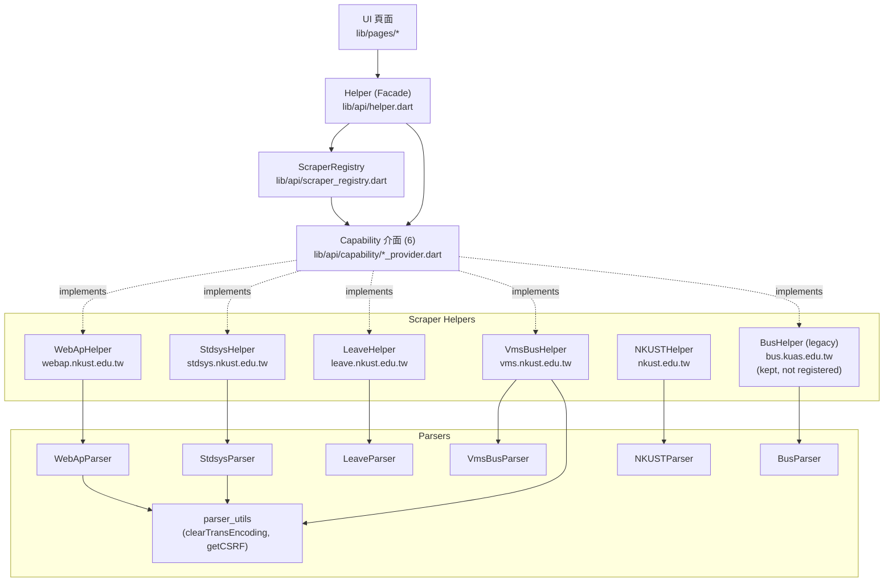
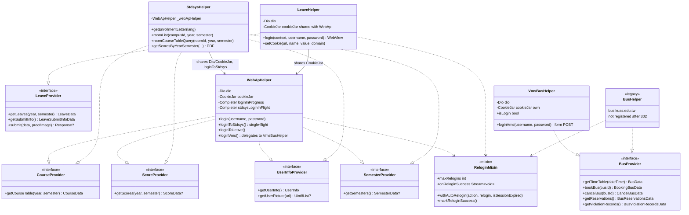
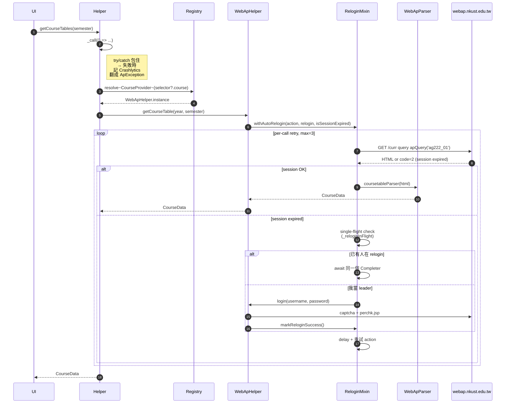
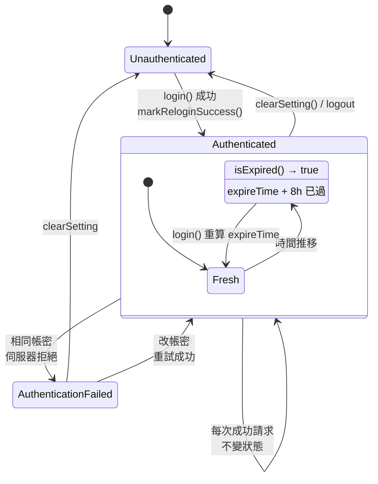
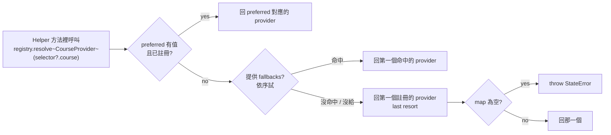
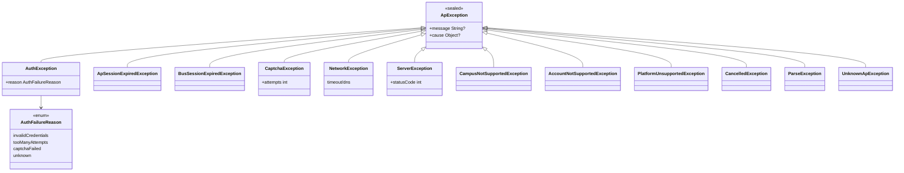

# 爬蟲架構總覽

> 狀態快照：#302 合併之後。對應 issue #230 的重構成果。
>
> 與 [refactor-scraper-state-design.md](./refactor-scraper-state-design.md) 互補 —
> 那份文件是重構時的設計決策記錄，這份是合併後的靜態結構參考。

## 目錄

- [1. 分層總覽](#1-分層總覽)
- [2. 類別實作關係](#2-類別實作關係)
- [3. 請求流程範例](#3-請求流程範例)
- [4. Session 狀態機](#4-session-狀態機)
- [5. Registry 解析邏輯](#5-registry-解析邏輯)
- [6. 例外階層](#6-例外階層)
- [附錄：檔案對照](#附錄檔案對照)

---

## 1. 分層總覽

**關鍵設計**：

| 層 | 責任 | 關鍵型別 |
|---|---|---|
| **UI** | 呼叫 `Helper.instance.xxx()` 拿資料 / 顯示 | — |
| **Facade（Helper）** | 統一錯誤處理（`_call` / `_busCall` / `_leaveCall`）、Crashlytics 記錄、把 `ApException` 翻回 UI 端 | `Helper` |
| **Registry** | 依 `CrawlerSelector` 把 capability 查找表映射到具體 helper | `ScraperRegistry`、`ScraperSource` |
| **Capability 介面** | 小粒度介面，每個定義一種資料能力 | `CourseProvider` / `ScoreProvider` / `UserInfoProvider` / `SemesterProvider` / `BusProvider` / `LeaveProvider` |
| **Helpers** | 實作介面；管自己的 Dio / CookieJar / 登入狀態；呼叫 Parser | 6 顆（見下） |
| **Parsers** | 純函式 / 靜態方法；HTML/JSON → Model | 7 檔 |
| **Utils** | 共用解析工具 | `clearTransEncoding`、`getCSRF` |

---

## 2. 類別實作關係

**要點**：

1. **小介面原則** — 每個 capability 定義一件事，helper 用 `implements A, B, C` 宣告多能力。
2. **`ReloginMixin` 不是必選** — `StdsysHelper` / `VmsBusHelper` 沒用，因為它們自己不持有完整 session（stdsys 透過 `WebApHelper.loginToStdsys` 由 webap 起頭的 SSO；vms 獨立但暫未包進 relogin mechanism）。
3. **`StdsysHelper` 沒有自己的 Dio** — 直接用 `_webApHelper.dio`、`_webApHelper.cookieJar`，因此只要 webap 登入並完成 stdsys SSO，cookie jar 同時帶著兩邊 session。
4. **`LeaveHelper` 共用 cookieJar**、但有自己的 Dio（因為 Header 不同、有 WebView 登入流程）。
5. **`VmsBusHelper` 完全獨立** — 自己的 Dio / CookieJar，不依賴 webap，因為 `vms.nkust.edu.tw` 的 login 是直接 form POST、跟 webap SSO 無關。
6. **`BusHelper` 仍存在但已從 Registry 登記移除**（#302）— 類別檔保留待另案評估是否完全刪除。

---

## 3. 請求流程範例

以 `Helper.instance.getCourseTables(semester: ...)` 為例：

**關鍵點**：
- **`_call` / `_busCall` / `_leaveCall`**：統一錯誤攔截層。把 `DioException`、`Exception` 翻成 `ApException` 子類；選擇性地丟去 Crashlytics（高訊號的才記）。
- **`withAutoRelogin`**：per-call 的 retry 計數（而非 static global，#342 修過的坑），single-flight relogin（避免併發請求都去撞 captcha）。
- **race-condition 區分**：若 `markReloginSuccess` 是 30 秒內剛發生的，第一次重試只 delay 不 relogin（伺服器端 session 初始化延遲不算 session expire）。

---

## 4. Session 狀態機

`ScraperSessionState`（`lib/api/session_state.dart`）是 sealed class：

| 狀態 | 欄位 | 語意 |
|---|---|---|
| `Unauthenticated` | — | 未登入 / 登出後 |
| `Authenticated` | `username`, `expireTime` | 有效 session；`isExpired` getter 檢查 8 小時窗 |
| `AuthenticationFailed` | `statusCode`, `message` | 登入被拒（密碼錯、鎖卡、等） |

> 目前 Helper 同時維持舊的靜態欄位（`Helper.username` / `password` / `expireTime`）與新的 `_sessionState` 是 dual-write 中間狀態，長期會收斂到只用後者（見 `refactor-scraper-state-design.md`）。

---

## 5. Registry 解析邏輯

**實際註冊狀況**（#302 合併後）：

| capability | `ScraperSource.webap` | `ScraperSource.stdsys` |
|---|---|---|
| `CourseProvider` | `WebApHelper` | `StdsysHelper` |
| `ScoreProvider` | `WebApHelper` | `StdsysHelper` |
| `UserInfoProvider` | `WebApHelper` | `StdsysHelper` |
| `SemesterProvider` | `WebApHelper` | `StdsysHelper` |
| `BusProvider` | `VmsBusHelper` | — |
| `LeaveProvider` | `LeaveHelper` | — |

使用者可在設定頁選 webap 或 stdsys 為各項 `CrawlerSelector` 的偏好來源；沒選的情況下 `resolve(null)` 回第一個註冊者（webap 排在前）。

`ScraperSource.mobile` enum case 已移除，但 `fromString` 會把 legacy JSON `"mobile"` 透過 `orElse` 映射到 `webap`，避免舊 config 爆炸。

---

## 6. 例外階層

**設計動機**（#372 / #373）：

- **Sealed** → UI 可做 exhaustive `switch`，編譯期檢查漏處理
- **分層攔截**：
  - Parser 丟 `ParseException`
  - Helper 丟 `AuthException` / `ServerException` / `CaptchaException`
  - `DioException.toApException()` 擴充把底層 transport 錯翻成 `NetworkException` / `ServerException`
  - `_busCall` / `_leaveCall` 把 HTTP 401 / 403 翻成 `ApSessionExpiredException` / `CampusNotSupportedException`
- **選擇性 Crashlytics**：`_call` 只上報高訊號的 subtype（排除 `CancelledException`、已知業務錯誤），避免儀表板被使用者狀態問題洗版
- **本地化**：`api_exception_l10n.dart` 把 `ApException` 轉成對應 i18n 字串給 UI 用

---

## 附錄：檔案對照

### `lib/api/`

| 檔案 | 角色 |
|---|---|
| `helper.dart` | Facade + Registry 組裝、`_call`/`_busCall`/`_leaveCall` |
| `scraper_registry.dart` | `ScraperSource` enum、`ScraperRegistry` |
| `session_state.dart` | sealed `ScraperSessionState` |
| `relogin_mixin.dart` | `ReloginMixin` — single-flight relogin |
| `api_config.dart` | `createScraperDio()` — Dio 預設設定工廠 |
| `ap_helper.dart` | `WebApHelper` |
| `stdsys_helper.dart` | `StdsysHelper` |
| `leave_helper.dart` | `LeaveHelper` |
| `vms_bus_helper.dart` | `VmsBusHelper`（#302 新增） |
| `bus_helper.dart` | `BusHelper`（legacy，未 registered） |
| `nkust_helper.dart` | `NKUSTHelper` — 學校公告 |
| `ap_status_code.dart` | 狀態碼常數（`sessionExpired`、`schoolServerError` 等） |
| `exceptions/api_exception.dart` | sealed `ApException` 階層 |
| `exceptions/api_exception_l10n.dart` | i18n 訊息映射 |
| `capability/*_provider.dart` | 6 個 capability 介面 |

### `lib/api/parser/`

| 檔案 | 角色 |
|---|---|
| `ap_parser.dart` | `WebApParser` |
| `stdsys_parser.dart` | `StdsysParser` |
| `leave_parser.dart` | `LeaveParser` |
| `vms_bus_parser.dart` | `VmsBusParser`（#302） |
| `nkust_parser.dart` | `NKUSTParser` |
| `bus_parser.dart` | legacy kuas bus |
| `parser_utils.dart` | `clearTransEncoding`、`getCSRF`（#379） |

---

## 擴充 checklist（新增資料來源時）

1. 寫一個 `XxxHelper` 類別，建構子拿到自己的 Dio / CookieJar 或借用 `WebApHelper` 的
2. 實作需要的 capability 介面（例：只做成績就 `implements ScoreProvider`）
3. 如果 session 會過期要重登，`with ReloginMixin`
4. 在 `Helper._registerProviders()` 加一行 `registry.register<ScoreProvider>(ScraperSource.xxx, XxxHelper.instance)`
5. 若要新 `ScraperSource` 值，在 `scraper_registry.dart` enum 加一個 case；`CrawlerSelector` 的 `copyWith` 也要有對應欄位（若使用者需要選擇）
6. 寫一個 `XxxParser` 靜態 class；共用函式優先考慮 `parser_utils.dart`
7. 在 `test/api_parser_test.dart` 加對應的 parser 單元測試；HTML / JSON fixture 放 `assets_test/xxx/`
8. `lib/api/helper.dart` 的呼叫方法若要改為多來源，用 `registry.resolve<T>(selector?.xxx)`；不用改 switch

---

_Last updated: #302 合併後（2026-04-19）_
