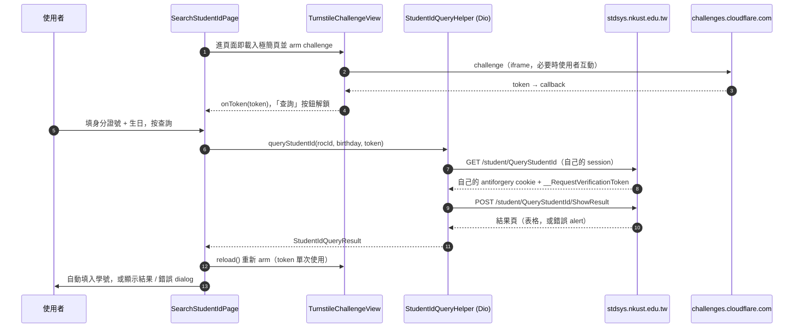

# 學號查詢改走 stdsys + Cloudflare Turnstile

## 背景與問題

學號查詢原本打 `webap.nkust.edu.tw`：先抓 `validateCode_foruid.jsp` 的 captcha 圖，用 `EuclideanCaptchaSolver` 做 template matching OCR，再帶著答案 POST `system/getuid_1.jsp`，最多重試 5 次。

學校把這個功能搬到 `https://stdsys.nkust.edu.tw/student/QueryStudentId`（ASP.NET Core），新頁的驗證方式換成 **Cloudflare Turnstile**，而且是 server-side 驗：

```
POST /student/QueryStudentId/ShowResult
IdNo=<身分證號>&Birthday=<民國 YYYMMDD>&__RequestVerificationToken=<antiforgery>
```

實測帶正確的 antiforgery token、但不帶 `cf-turnstile-response`，server 回：

> 登入失敗！不當登入！機器人驗證失敗！

也就是說**純 HTTP 爬不過去**。Turnstile 的 token 只能由真的 browser engine 跑完 challenge 才拿得到，不像舊的圖形 captcha 可以本機 OCR。

## 方案選擇

| 方案 | 結論 |
|------|------|
| 繼續用 webap OCR 路徑 | 目前還活著，但學校已把功能搬走，屬於隨時會關的舊介面；留兩套只會兩套都腐爛 |
| 用第三方 captcha solving 服務 | 要錢、要把使用者身分證號送去第三方，隱私上不可接受 |
| **WebView 跑 challenge**（採用） | 沿用 `flutter_inappwebview`（leave 登入已在用），token 由 Cloudflare 直接發給頁面，App 端不碰任何驗證邏輯 |

## 怎麼做

輸入 UX 全部是原生表單（生日 date picker + 身分證號 + 「自動填入」勾選），Turnstile 以**內嵌 widget** 的形式放在表單裡，不是送出時才跳一個 WebView 頁；查詢本身是 Dart 這邊的 form POST：



### 為什麼只有 Turnstile token 跨過來

兩張 token 的性質不同：

| Token | 來源 | 能不能離開 WebView |
|-------|------|-----------------|
| `cf-turnstile-response` | Cloudflare 發，必須真的 browser engine 跑完 challenge | 可以。`siteverify` 是 stateless、只吃 `secret` + `response`，token 單次使用、TTL 300 秒，與呼叫端的 session 無關 |
| `__RequestVerificationToken` + `.AspNetCore.Antiforgery.*` cookie | ASP.NET Core 發，兩者成對驗證 | 不行。那個 cookie 是 HttpOnly，`document.cookie` 讀不到，官方 `webview_flutter` 的 `WebViewCookieManager` 也只有 `setCookie` / `clearCookies` |

所以 antiforgery 那組由 `StudentIdQueryHelper` 自己 GET 一次去拿，兩邊各自持有自己那份配對，只有 Turnstile token 跨 session 搬過去。每次查詢都用新的 `CookieJar`，避免沿用上一次已失效的 antiforgery cookie。**已實測**：token 跨 session 可用，學校沒有把它綁在自己的 session 上。

### 極簡頁承載 challenge

sitekey 綁 hostname allowlist（清單在學校的 Cloudflare dashboard），所以頁面的 origin 必須看起來是 `stdsys.nkust.edu.tw`，否則 challenge 回 110200（invalid domain）。因此用 `loadHtmlString(html, baseUrl: queryUrl)`：頁面內容是我們自己的十行 HTML（`api.js` + 一個 `.cf-turnstile`），origin 則由 `baseUrl` 提供。

這樣就不必為了畫一個 widget 去載學校那 12KB 的查詢頁與整包 admin-lte / font-awesome / sweetalert2，載入快很多，學校改版也動不到我們。極簡頁裡照樣放 `.cf-turnstile` placeholder，所以注入的 render 腳本兩種模式共用。**已實測**：Cloudflare 接受這個 origin，且 server 不比對 `siteverify` 回應裡的 hostname。

若日後 Cloudflare 收緊此行為，把 `TurnstileChallengeView.useMinimalPage` 設成 `false` 即可退回載真頁（腳本會把頁面其餘部分用 CSS 藏起來）。

### WebView 端的三個地雷

用官方 `webview_flutter`。這三點官方文件都有列，漏掉任何一項 challenge 都會卡死：<https://developers.cloudflare.com/turnstile/get-started/mobile-implementation/>

1. **Android 要開 third-party cookies** — challenge 跑在 iframe 內屬 third-party context，Android WebView 預設擋掉它的 cookie。對應寫法是把 `controller.platform` 與 `WebViewCookieManager().platform` 各自 type check 成 `AndroidWebViewController` / `AndroidWebViewCookieManager` 後呼叫 `setAcceptThirdPartyCookies`。
2. **`about:blank` / `about:srcdoc` 必須放行** — challenge widget 會用這些 scheme 建巢狀 iframe。
3. **host 比對的外部連結判斷只能套在 main frame** — 否則 `challenges.cloudflare.com` 的 subframe 會被當外部連結丟出 App。這裡沒有任何往外的連結需求，所以 `NavigationDelegate` 不掛 `onNavigationRequest`、完全不攔。

### 不要偽裝 user agent

`WebViewController` 不呼叫 `setUserAgent`，用引擎自己的字串。在行動 WebView 裡宣稱自己是桌面 Chrome，`navigator` 與 client hints 會跟實際 engine 對不起來，Turnstile 的 browser integrity 判定會直接讓 challenge 失敗——這是實際踩過的坑。

### 自己 explicit render，不要輪詢

`.cf-turnstile` 沒有 `data-callback`，implicit render 什麼都拿不到：成功只能輪詢隱藏欄位、失敗的錯誤碼鎖在跨網域 iframe 裡。因此自己 `turnstile.render`，拿三個 callback：

- `callback`：token 直接回 Dart，解鎖「查詢」按鈕
- `expired-callback`：token 只活 300 秒，內嵌 widget 很可能放著沒動就過期，過期時清掉 token、按鈕回到 disabled
- `error-callback`：Cloudflare 錯誤碼回 Dart 並顯示在表單下方，release build 才有辦法診斷

### 結果解析

成功頁是一張表格，表頭為 `入學學年-學期 / 系所 / 學制 / 學生姓名 / 學號 / 在學狀態 / 備註`，值在資料列的對應欄位——**不是**緊接在標籤後面。所以 `queryStudentIdResultParser` 先比對表頭找出 `學號` / `姓名` / `在學狀態` 各在第幾欄，再去資料列取 `td`；一個人可能有多列（例如學士後又碩士），優先取「在學狀態」含「在學」那列，否則取第一列。不依賴 class 名稱——那張表的 class 是拼錯的 `borded`。

失敗時取 `.alert` 的文字當訊息（查無此人、機器人驗證失敗等），直接顯示 server 原文。注意 `alert` 這個字串在 `<head>` 的 sweetalert2 CSS 連結裡也會出現，所以判斷要用 `querySelector('.alert')` 而不是字串比對。

非表格排版的「標籤旁取值」邏輯保留為 fallback。`queryStudentIdFormTokenParser` 負責從查詢頁撈 `__RequestVerificationToken`。

測試在 `test/api_parser_test.dart`：查詢頁與失敗頁是真實抓下來的 fixture（`assets_test/stdsys/query_student_id_form.html`、`query_student_id_bot_failed.html`）；成功頁的表頭排版照真實頁面寫，資料列是編的，避免把個人學號放進 repo。

## 影響範圍

- 移除 `NKUSTHelper.getUsername` / `getUidValidationImage` / `NKUSTHelper.captchaSolver` 與 `Helper.searchUsername`（webap OCR 路徑整條刪掉）。
- `EuclideanCaptchaSolver` 保留 — `WebApHelper` 的登入流程還在用。
- 新增 `lib/widgets/turnstile_challenge_view.dart`（內嵌 challenge、只產 token）、`StudentIdQueryHelper`（Dio 送查詢）、`Helper.queryStudentId`、`StudentIdQueryResult`、`StdsysParser.queryStudentIdResultParser` 與 `queryStudentIdFormTokenParser`。
- 新增官方 `webview_flutter` 相依。`flutter_inappwebview` 仍保留給 leave 的頁面使用，兩個 engine 並存；把 leave 一併遷移另案處理。

## 已驗證範圍

iOS simulator（iPhone 16e / iOS 26）與 Android emulator（API 36）都用真實資料跑完整條流程並取得正確的學號與姓名，含 `setAcceptThirdPartyCookies` 那條 Android 專屬路徑。

Android WebView 過程中會出現兩條無害訊息：challenge 頁附屬資源的 `net::ERR_ADDRESS_UNREACHABLE`（emulator 的 SLIRP 網路對 IPv6 支援不完整）與 Cloudflare 自己的 `OTS parsing error: WOFF 2.0` 字型雜訊，都不影響 challenge 完成。實機尚未跑過。

## 變更歷史

- 2026-09-03：改用 stdsys + Turnstile WebView 流程，移除 webap OCR 路徑。
- 2026-09-04：改用官方 `webview_flutter`、移除偽裝 UA（原本會讓 challenge 直接失敗）、改成 explicit render；challenge 內嵌在原生表單裡，查詢改由 `StudentIdQueryHelper` 用 Dio 送出；challenge 承載在自製極簡頁（`baseUrl` 提供 origin）；結果解析改為比對表頭欄位。
