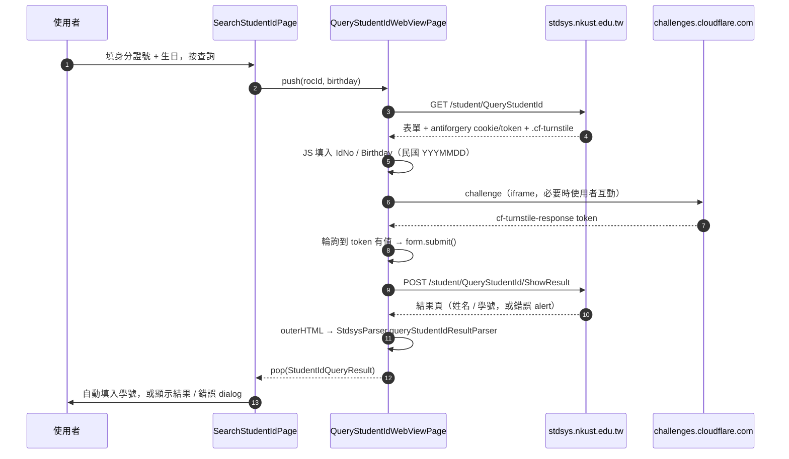

# 學號查詢改走 stdsys + Cloudflare Turnstile

## 背景與問題

學號查詢原本打 `webap.nkust.edu.tw`：先抓 `validateCode_foruid.jsp` 的 captcha 圖，用 `EuclideanCaptchaSolver` 做 template matching OCR，再帶著答案 POST `system/getuid_1.jsp`，最多重試 5 次。

學校把這個功能搬到 `https://stdsys.nkust.edu.tw/student/QueryStudentId`（ASP.NET Core），新頁的驗證方式換成 **Cloudflare Turnstile**，而且是 server-side 驗：

```
POST /student/QueryStudentId/ShowResult
IdNo=<身分證號>&Birthday=<民國 YYYMMDD>&__RequestVerificationToken=<antiforgery>
```

實測帶正確的 antiforgery token、但不帶 `cf-turnstile-response`，server 回：

> 登入失敗！不當登入！機器人驗證失敗！

也就是說**純 HTTP 爬不過去**。Turnstile 的 token 只能由真的 browser engine 跑完 challenge 才拿得到，不像舊的圖形 captcha 可以本機 OCR。

## 方案選擇

| 方案 | 結論 |
|------|------|
| 繼續用 webap OCR 路徑 | 目前還活著，但學校已把功能搬走，屬於隨時會關的舊介面；留兩套只會兩套都腐爛 |
| 用第三方 captcha solving 服務 | 要錢、要把使用者身分證號送去第三方，隱私上不可接受 |
| **WebView 跑 challenge**（採用） | 沿用 `flutter_inappwebview`（leave 登入已在用），token 由 Cloudflare 直接發給頁面，App 端不碰任何驗證邏輯 |

## 怎麼做

輸入 UX 沿用原生表單（身分證號欄位 + 生日 date picker + 「自動填入」勾選），只有 challenge 那段進 WebView：



### WebView 端的三個地雷

這三點官方文件都有列，漏掉任何一項 challenge 都會卡死：<https://developers.cloudflare.com/turnstile/get-started/mobile-implementation/>

1. **Android 要開 third-party cookies** — challenge 跑在 iframe 內屬 third-party context，Android WebView 預設擋掉它的 cookie，challenge 就永遠過不了。對應設定是 `InAppWebViewSettings(thirdPartyCookiesEnabled: true)`。
2. **`about:blank` / `about:srcdoc` 必須放行** — challenge widget 會用這些 scheme 建巢狀 iframe。
3. **host 比對的外部連結判斷只能套在 main frame** — 否則 `challenges.cloudflare.com` 的 subframe 會被當外部連結丟出 App。本頁面沒有任何往外的連結需求，所以直接 `useShouldOverrideUrlLoading: false` 完全不攔，是最安全的做法。

另外 `clearCache: true`：每次查詢都要新的 antiforgery cookie/token 配對，快取頁面會拿到已用掉的 Turnstile token。

### 自動送出

Turnstile widget 是從 `.cf-turnstile` 隱式渲染、沒有 `data-callback`，所以沒有 callback 可掛。注入的 JS 改用輪詢 hidden field `[name="cf-turnstile-response"]`，一有值就 `form.submit()`。非互動式 challenge 的情況下使用者完全不需要動作。

### 結果解析

`StdsysParser.queryStudentIdResultParser` 吃結果頁 HTML，回傳 `StudentIdQueryResult`：

- 成功：以 `姓名` / `學號` 標籤配對取值。結果頁沒有穩定的 id 或 data attribute，比對標籤而不是 markup，學校改版時比較不容易壞；element 邊界會被轉成空白，所以「同一個 text node」與「相鄰 table cell」兩種寫法都吃得下。
- 失敗：取 `.alert` 的文字當訊息（查無此人、機器人驗證失敗等），直接顯示 server 的原文。

測試在 `test/api_parser_test.dart`，失敗頁是真實抓下來的 fixture（`assets_test/stdsys/query_student_id_bot_failed.html`）；成功頁需要有效身分證號才抓得到，所以是 synthetic markup，並刻意涵蓋上述兩種排版。

## 影響範圍

- 移除 `NKUSTHelper.getUsername` / `getUidValidationImage` / `NKUSTHelper.captchaSolver` 與 `Helper.searchUsername`（webap OCR 路徑整條刪掉）。
- `EuclideanCaptchaSolver` 保留 — `WebApHelper` 的登入流程還在用。
- 新增 `lib/pages/query_student_id_web_view_page.dart`、`StudentIdQueryResult`、`StdsysParser.queryStudentIdResultParser`。

## 待驗證

成功頁的實際 markup 尚未取得（需要有效身分證號 + 生日）。第一次用真實資料查詢時要確認 `queryStudentIdResultParser` 抓到的 `id` / `name` 正確，必要時把真實 fixture 補進 `assets_test/stdsys/`。

## 變更歷史

- 2026-09-03：改用 stdsys + Turnstile WebView 流程，移除 webap OCR 路徑。
