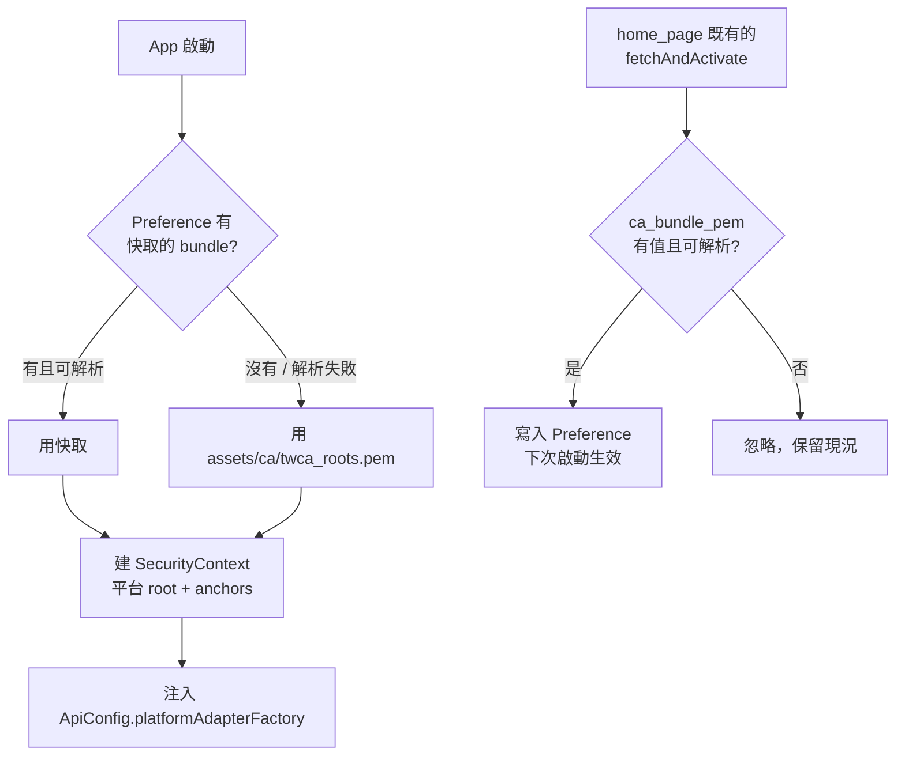

# NKUST 憑證信任

## 為什麼需要這份文件

2026-09-08 學校重簽了 `*.nkust.edu.tw`，連 root CA 一起換了：

| | 2025 憑證 | 2026-09-08 憑證 |
|---|---|---|
| Leaf | `CN=*.nkust.edu.tw` | 同左 |
| Sub-CA | `TWCA Secure SSL Certification Authority` | `TWCA SSL Certification Authority` |
| Root | `TWCA Global Root CA`（到 2030-12-31） | `TWCA CYBER Root CA`（到 2047-11-22） |

`TWCA CYBER Root CA` 進了 Mozilla CCADB 與 Chrome Root Store，但 **Apple 的 trust store 沒有收錄**。AOSP 也是到 Android 16 才把它放進系統 store。

後果是 Apple 平台上所有 HTTP stack 直接拒絕學校的憑證鏈，Android 則因為走 Cronet（驗證對象是 Chrome Root Store）完全沒受影響。

在此之前 App 的作法是把 **leaf** 放進 `assets/`，每年學校換憑證就手動換一次檔案再發版；Android 另外掛了一個全域 `HttpOverrides` 把憑證驗證整個關掉。兩者都已移除。

## 現在的設計

### 1. Pin root，不 pin leaf

`assets/ca/twca_roots.pem` 收三張 TWCA root：

| Root | 到期 |
|---|---|
| `TWCA Global Root CA` | 2030-12-31 |
| `TWCA Root Certification Authority` | 2030-12-31 |
| `TWCA CYBER Root CA` | 2047-11-22 |

Root 的壽命遠長於 leaf，學校在 TWCA 體系內怎麼換 sub-CA、怎麼跳 root 都不需要動 App。這消滅了「每年手動換憑證」。

重新產生這份 bundle：

```bash
security find-certificate -a -c TWCA -p \
  /System/Library/Keychains/SystemRootCertificates.keychain > assets/ca/twca_roots.pem
curl -s http://sslserver.twca.com.tw/cacert/cyber_root_2022.crt \
  | openssl x509 -inform DER >> assets/ca/twca_roots.pem
```

`cyber_root_2022.crt` 走的是 HTTP，匯入前務必核對指紋：

```
SHA-256  3F:63:BB:28:14:BE:17:4E:C8:B6:43:9C:F0:8D:6D:56:F0:B7:C4:05:88:3A:56:48:A3:34:42:4D:6B:3E:C5:58
```

這組指紋與 AOSP `system/ca-certificates/files/47b283f6.0` 及 Chrome Root Store 的收錄一致。

### 2. Bundle 可由 Remote Config 覆寫

Pin root 解決了每年換 leaf 的問題，但沒解決真正打爛 iOS 的那個情境：**學校換到一張 App 沒聽過的 CA**。發版不能當解法，因為沒更新的使用者一樣連不上。

所以 `CaTrustBundle`（`lib/integrations/security/ca_trust_bundle.dart`）支援用 Remote Config key `ca_bundle_pem` 覆寫 asset。之後再遇到同樣的事，推一次 config 就好，不發版、不送審。

兩條界線讓它不至於變成後門：

- anchor 是**加上去**的，不取代平台 root，憑證驗證從不關閉；
- 無法解析成憑證的 bundle 會被拒絕並保留舊的，所以推錯內容不會讓 App 斷線。

新 bundle 在**下次冷啟動**生效 —— `SecurityContext` 建好就交給長壽命的 HTTP client，為了一件好幾年才發生一次的事去做熱抽換不划算。

流程：



### 3. 各平台落點

| 平台 | HTTP stack | 憑證來源 | 處理 |
|---|---|---|---|
| Android | Cronet（`native_dio_adapter`） | Chrome Root Store | 不用動，本來就信任 |
| iOS / macOS | `dart:io`（`IOHttpClientAdapter`） | 平台 root + bundle | `CaTrustBundle` 補 anchor |
| WebView | WKWebView / Android WebView | 平台 root | 不直連學校，見下 |

iOS 為什麼不能留在 NSURLSession：`cupertino_http` 的 `URLSession.sessionWithConfiguration` 只暴露 `onRedirect` / `onResponse` / `onData` / `onFinishedDownloading` / `onComplete` / `onWebSocketTask*`，**沒有 `didReceiveChallenge`**，Dart 層碰不到 trust evaluation。`dart:io` 是唯一能塞 anchor 的地方。

WebView 同樣沒有可用的 hook，所以做法是讓所有連學校的 TLS 都留在 Dart 這側 —— 詳見 [student-id-query-turnstile.md](student-id-query-turnstile.md) 的「WebView 不直連學校（憑證）」。

## 已知限制

**Android 沒有退路。** Cronet 不吃自訂 anchor，也不讀 Android 系統 CA store。目前它信任所有學校用過的 TWCA root，但如果哪天學校換到一張 Chrome Root Store 沒收錄的 CA，Remote Config 救不了 Android —— 那時才需要考慮把 Android 也降到 `dart:io`。沒有先做，是因為那會換掉 Cronet 的 TLS fingerprint，而 `stdsys` 在 Cloudflare 後面，風險不對稱。

**根治方式仍在學校手上。** 請計中把憑證換簽到 `TWCA Global Root CA` 底下的 sub-CA，Apple / Chrome / Android 全版本都收錄，以上所有處理都可以拆掉。

## 測試

Live test 不再關閉憑證驗證。`packages/nkust_crawler/test/live/_helpers.dart` 的 `trustNkustRoots()` 載入的就是 App 用的同一份 `assets/ca/twca_roots.pem`：

```bash
cd packages/nkust_crawler

# 不需帳密
dart test -P live-anonymous -r expanded

# 需要帳密
NKUST_USER=... NKUST_PASS=... dart test -P live -r expanded
```

舊的 `acceptAnyTlsCertificate()` 會讓整個 test process 不驗憑證，也正因如此 2026-09 那次 CA 變更沒有被測出來。現在學校再換 CA，live test 會直接紅。

## 變更歷史

- 2026-09-11：改 pin root 並移除全域 `HttpOverrides`；iOS/macOS 改走 `dart:io` + `CaTrustBundle`；接上 Remote Config 覆寫；live test 改為真的驗憑證。
